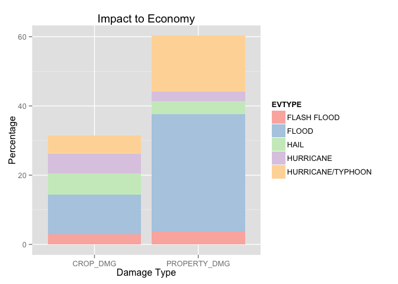

# Severe Weather Events and Their Impacts to the Human Population
Sasmito Adibowo  
19 November 2014  

## Synopsis

This document reports the impact of severe weather events in the United States with respect to country's personal and monetary damages. The data set was taken from the U.S. National Oceanic and Atmospheric Administration's (NOAA) storm database and ranges from the year 1950 until 2011.

In conclusion tornado is the largest severe weather event that causes the most injuries and fatalities. Whereas property or crop damages tend to come primarily from floods and secondarily from hurricanes/typhoons.

This report is delivered as an assignment to online Coursera course [Reproducible Research](https://www.coursera.org/course/repdata) by Roger D. Peng, et. al.

## Data Processing

We download the source data set from the URL given in the assignment and parse it for subsequent calculation. Furthermore since the download and parse phases are both time consuming, we save the intermediate results as files into the current working directory and load these files instead if they are available.


```r
library(sqldf)
```

```
## Loading required package: gsubfn
## Loading required package: proto
## Could not load tcltk.  Will use slower R code instead.
## Loading required package: RSQLite
## Loading required package: DBI
```

```r
library(dplyr)
```

```
## 
## Attaching package: 'dplyr'
## 
## The following object is masked from 'package:stats':
## 
##     filter
## 
## The following objects are masked from 'package:base':
## 
##     intersect, setdiff, setequal, union
```

```r
library(data.table)
```

```
## 
## Attaching package: 'data.table'
## 
## The following objects are masked from 'package:dplyr':
## 
##     between, last
```

```r
library(lubridate)
```

```
## 
## Attaching package: 'lubridate'
## 
## The following objects are masked from 'package:data.table':
## 
##     hour, mday, month, quarter, wday, week, yday, year
```

```r
library(ggplot2)
library(reshape2)

if(!exists("stormData")) {
    stormData <- (function() {
        inputFileParsed <- "StormData.rds"
        if(!file.exists(inputFileParsed)) {
            inputFileName <- "StormData.csv.bz2"
            if(!file.exists(inputFileName)) {
                download.file("http://d396qusza40orc.cloudfront.net/repdata/data/StormData.csv.bz2",inputFileName)
            }
            stormData <- data.table(read.csv(bzfile(inputFileName)))
            setkey(stormData,REFNUM)
            saveRDS(stormData,inputFileParsed)
        } else {
            stormData <- readRDS(inputFileParsed)
        }
        stormData
    })()
}
```

We then perform a light preprocessing step in which the monetary damage estimates are normalized. The `CROPDMGEXP` and `PROPDMGEXP` fields are exponents denoting `B` for *billion*, `M` for *million*, `K` for thousands (from the metric word *kilo*) and `H` for hundreds. There are some noise values for these exponent fields and for these cases we assume that the exponents and respective base values are invalid (in other words `NA`).

In addition, there are some inconsistencies in the `EVTYPE` fields, but due to the large number of events (about 900 entries), we only cater for case mismatch in this field. Therefore we force it into uppercase.


```r
validExp <- data.table(
    EXP=c("B","M","K","H","NA"),
    VAL=c(1e9,1e6,1e3,1e2,0),
    key="EXP"
    )

stormDataCleaned <- stormData %>%
    mutate(PROPDMGEXP=toupper(as.character(PROPDMGEXP)),
           CROPDMGEXP=toupper(as.character(CROPDMGEXP))
           )  %>%
    mutate(
        PROPDMG_VAL = PROPDMG * validExp[PROPDMGEXP]$VAL,
        CROPDMG_VAL = CROPDMG * validExp[CROPDMGEXP]$VAL,
        EVTYPE = toupper(EVTYPE)
    )
```

Afterwards we normalize the impact values (injuries, fatalities, property damage, and crop damage) into percentage values. For simplicity, the property damage and crop damage values are not adjusted for inflation.


```r
injuriesTotal <- sum(stormDataCleaned$INJURIES,na.rm=TRUE)
fatalitiesTotal <- sum(stormDataCleaned$FATALITIES,na.rm=TRUE)
cropDmgTotal <- sum(stormDataCleaned$CROPDMG_VAL,na.rm=TRUE)
propDmgTotal <- sum(stormDataCleaned$PROPDMG_VAL,na.rm=TRUE)

stormImpact <- stormDataCleaned %>%
    group_by(EVTYPE) %>%
    summarize(
        INJURIES_SUM=sum(INJURIES,na.rm=TRUE),
        FATALITIES_SUM=sum(FATALITIES,na.rm=TRUE),
        PROPDMG_SUM=sum(PROPDMG_VAL,na.rm=TRUE),
        CROPDMG_SUM=sum(CROPDMG_VAL,na.rm=TRUE)
    )  %>%
    mutate(INJURIES_PCT = INJURIES_SUM / injuriesTotal * 100,
           FATALITIES_PCT = FATALITIES_SUM / fatalitiesTotal * 100,
           CROPDMG_PCT = CROPDMG_SUM / cropDmgTotal * 100,
           PROPDMG_PCT = PROPDMG_SUM / propDmgTotal * 100
           ) 
```

## Results

### Impact to Population Health

We take the top 10 events that causes the most injuries or fatalities and then combine these two lists together to create a common-denominator events that is most impactful to the population's health.

As you can see in the figure below, tornado and excessive heat are the largest detriments to the population's health.


```r
mostInjuries <- stormImpact[order(-INJURIES_PCT)][1:10] %>% select(EVTYPE,INJURIES_PCT)
mostFatalities <- stormImpact[order(-FATALITIES_PCT)][1:10] %>% select(EVTYPE,FATALITIES_PCT)
mostHealthImpact <- inner_join(mostInjuries,mostFatalities,by="EVTYPE") 
ggplot(
    data=mostHealthImpact %>% 
        mutate(INJURIES=INJURIES_PCT,
               FATALITIES=FATALITIES_PCT
               ) %>%
        select(EVTYPE,INJURIES,FATALITIES) %>%
        melt(id="EVTYPE")
    ) + 
    geom_bar(stat="identity") + 
    aes(
        x=variable,
        y=value,
        fill=EVTYPE
        ) + 
    ggtitle("Impact to Population Health") +
    xlab("Impact Type") + 
    ylab("Percentage") + 
    scale_fill_brewer(palette="Pastel1")
```

 

### Economic Consequences

We take the top 10 most damaging events to property and crop then combine them together to obtain a short list of events that has the most economic consequences. For simplicity, the monetary values are not inflation-ajusted. 

As you can see below, the most damaging events are flood and hurricane/typhoon.


```r
mostCropImpact <- stormImpact[order(-CROPDMG_PCT)][1:10] %>% select(EVTYPE,CROPDMG_PCT)
mostPropImpact <- stormImpact[order(-PROPDMG_PCT)][1:10] %>% select(EVTYPE,PROPDMG_PCT)
mostEconomicImpact <- inner_join(mostCropImpact,mostPropImpact,by="EVTYPE") %>% 
    select(EVTYPE,CROPDMG_PCT,PROPDMG_PCT)
ggplot(
    data=mostEconomicImpact %>% 
        mutate(CROP_DMG=CROPDMG_PCT,PROPERTY_DMG=PROPDMG_PCT) %>%
        select(EVTYPE,CROP_DMG,PROPERTY_DMG) %>%
        melt(id="EVTYPE")
    ) + 
    geom_bar(stat="identity") + 
    aes(
        x=variable,
        y=value,
        fill=EVTYPE
        ) + 
    ggtitle("Impact to Economy") +
    xlab("Damage Type") + 
    ylab("Percentage") + 
    scale_fill_brewer(palette="Pastel1")
```

 

